# ARAP User Guide

**AirNav Risk Analysis Platform — version 0.8**

ARAP is the web application that implements the *AirNav Risk Analysis Manual*. It lets AirNav staff plan, run, review and approve safety risk assessments with twenty-six methods, keeps every hazard in one hazard log, and produces the Safety Assessment Report.

This guide explains how to use the application. For *why* and *when* to use each method, see the Manual (`docs/AirNav_Risk_Analysis_Manual.pdf`). For the formal requirements, see the SRS (`docs/AirNav_Risk_Analysis_Software_Requirements.pdf`).

---

## Contents

1. [Getting started](#1-getting-started)
2. [The dashboard](#2-the-dashboard)
3. [Projects and assessments (incl. assessment templates, archiving and deleting)](#3-projects-and-assessments)
4. [Working in a method study](#4-working-in-a-method-study)
5. [Worksheet methods: HAZID, HAZOP, JHA, FMEA/FMECA, FHA](#5-worksheet-methods)
6. [Bowtie analysis](#6-bowtie-analysis)
7. [LOPA](#7-lopa)
8. [Fault tree analysis](#8-fault-tree-analysis)
9. [Fatigue modelling](#9-fatigue-modelling)
10. [Bayesian belief networks](#10-bayesian-belief-networks)
11. [STPA](#11-stpa)
12. [FRAM](#12-fram)
13. [Extended methods: CRM, ETA, HRA, ERC/RAT, GSN, CCA, RBD/Markov, SWIFT, HTA, simulation, expert judgement, security, investigation, wildlife, investigation expert system, ATSB analysis](#13-extended-methods-manual-chapters-1831)
14. [The hazard log](#14-the-hazard-log)
15. [Actions](#15-actions)
16. [Review, approval and locking](#16-review-approval-and-locking)
17. [Reports and exports](#17-reports-and-exports)
18. [Administration](#18-administration)
19. [Troubleshooting and FAQ](#19-troubleshooting-and-faq)
20. [What version 0.8 does not do yet](#20-what-version-08-does-not-do-yet)

---

## 1. Getting started

### 1.1 Signing in

Open ARAP in a browser (Chrome, Edge, Firefox or Safari) at the address your administrator gives you — for a local installation this is `http://localhost:8080`. Enter your username and password.

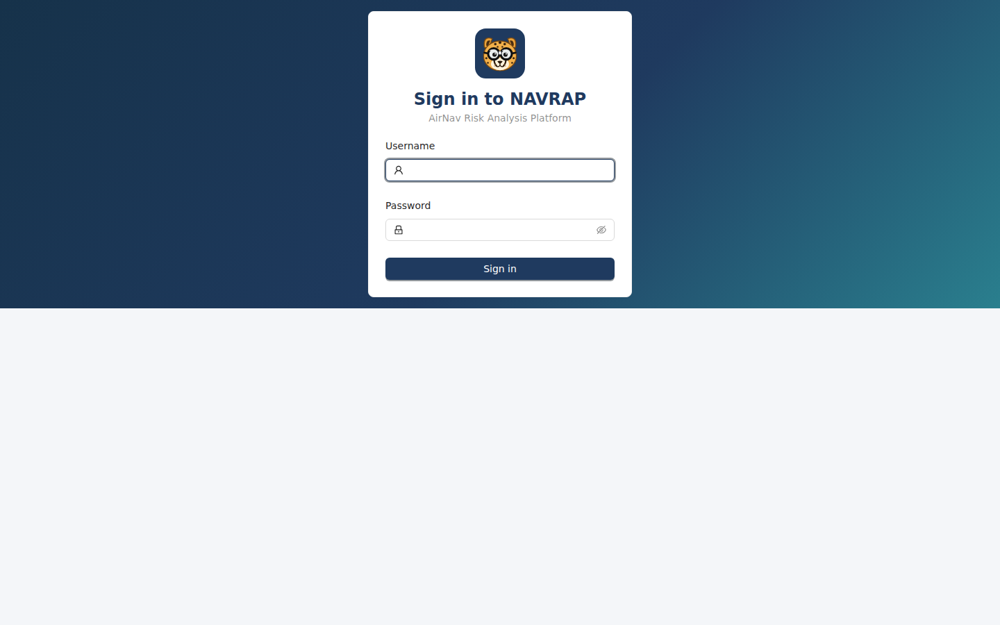

### 1.2 Roles

What you can do depends on your role:

| Role | Can do |
|---|---|
| **Viewer** | Read everything in their scope; update actions they own. |
| **Assessor** | Create projects, assessments and method studies; edit worksheets and diagrams; send hazards to the hazard log; raise actions; submit assessments for review. |
| **Reviewer** | Everything an assessor can, plus return, endorse or reject assessments, and read the audit trail. |
| **Authority** | Accept (or reject) residual risk, but only for the risk regions assigned to them (for example *Tolerable (lower)*). |
| **Admin** | Manage users, roles and the risk classification scheme. Admin is not a substitute for the proper acceptance authority in normal use. |

### 1.3 Demo accounts

When ARAP is installed with demo data (`ARAP_SEED_DEMO=true`), these accounts exist, all with password `demo1234`:

| Username | Role | May accept |
|---|---|---|
| `assessor` | Assessor | — |
| `reviewer` | Reviewer | — |
| `director` | Authority | Tolerable (lower), Acceptable |
| `accexec` | Authority (Accountable Executive) | Tolerable (upper), Tolerable (lower), Acceptable |
| `viewer` | Viewer | — |

The administrator account is `admin`; its password is set at installation. **Disable the demo data and change all passwords before real use.**

### 1.4 Screen layout and language

- The **left menu** gives access to the Dashboard, Projects & assessments, Hazard log, Actions, Risk scheme and User guide (plus Users and Audit trail for administrators and reviewers).
- The **EN / ID** switch at the top right changes the interface language between English and Bahasa Indonesia. Your choice is remembered on that computer. Text you type into worksheets is stored as entered.
- Your name and role are shown top right; click them to sign out.

---

## 2. The dashboard

The dashboard is the organisation-wide risk picture, built from the hazard log.

- **Key figures** — hazards in the log, overdue actions, hazard reviews due within 30 days, and assessments waiting for review.
- **Current risk profile** — the 5 × 5 risk matrix with the number of hazards in each cell (residual risk where rated, otherwise initial risk).
- **Hazards by risk region**, **Assessments by status**, **Controls by effectiveness** and **Studies by method** charts.
- **Overdue actions** and **Reviews due** lists — click an item to open it.

---

## 3. Projects and assessments

### 3.1 Projects

A **project** represents one change: a new system, a procedure, an airspace change, an organisational change or a temporary change. Go to **Projects & assessments → New project** and enter a code (e.g. `ADSB-2027`), a title, the type of change, the units affected and the sponsor.

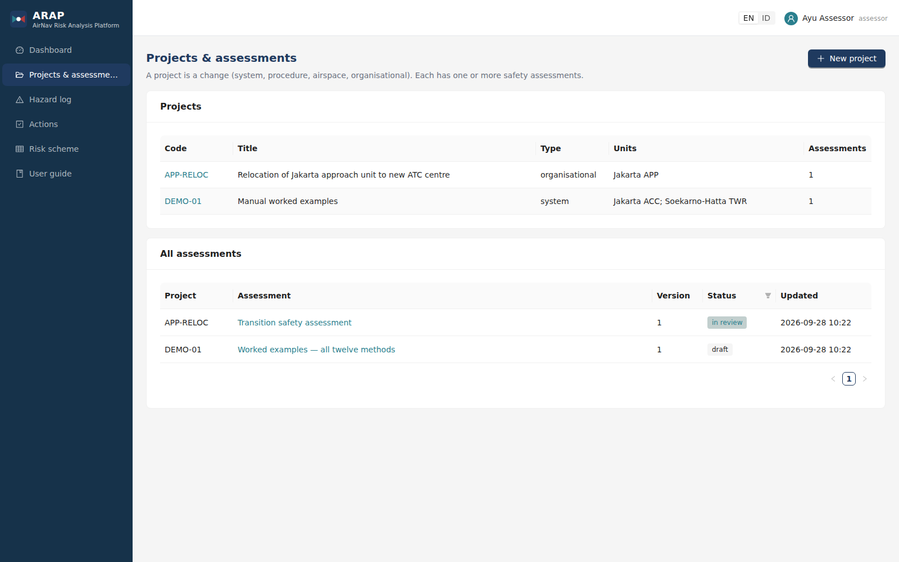

### 3.2 Assessments

Open the project and choose **New assessment**. Describe the **scope and system boundary**, the **operational environment** and your **assumptions** (Manual §2.3). The assessment records which version of the risk scheme it uses.

The assessment page brings everything together:

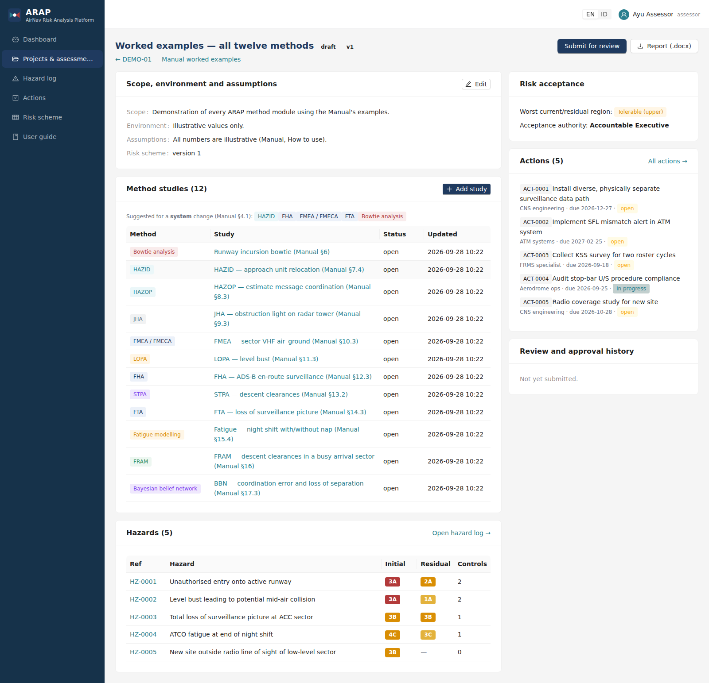

- **Method studies** — the analyses carried out for this assessment. ARAP suggests methods for the type of change (Manual §4.1); the suggestion is only advice.
- **Hazards** — hazard-log entries that belong to this assessment, with initial and residual risk.
- **Risk acceptance** — the worst residual risk region and the authority that must accept it.
- **Actions** and the **review and approval history**.
- Workflow buttons at the top right (see [section 15](#15-review-approval-and-locking)) and **Report (.docx)**.

### 3.3 Adding a method study

On the assessment page choose **Add study**, pick the method (suggested methods are marked ★) and give the study a title, e.g. *HAZOP of cut-over plan*. The study opens straight away.

---

### 3.4 Starting from an assessment template

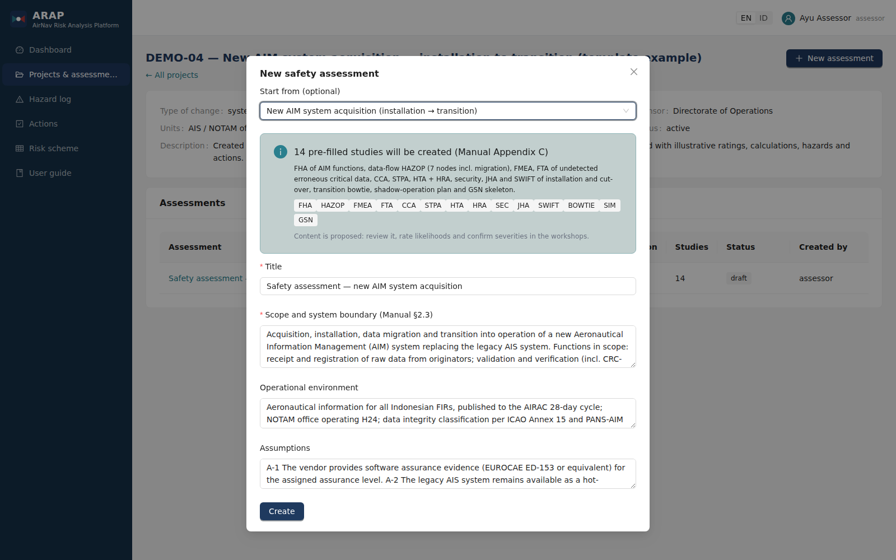

In **New assessment**, the field **Start from** offers ready-made assessment templates. When you choose one:

- ARAP fills in the title, scope, environment and assumptions. Edit them for your change.
- On **Create**, ARAP also creates all of the template's method studies, pre-filled with proposed content.
- Nothing is rated for you. Likelihoods, calculations and hazard-log entries are left for your workshops, and severities are proposals to confirm.

**New AIM system acquisition** (Manual Appendix C) creates 14 studies covering the whole life of the change, from specification through installation and data migration to transition:

| Study | Pre-filled content |
|---|---|
| FHA | 8 AIM functions and 12 failure conditions (loss, delay, detected and undetected error) with proposed severities and requirements |
| Data-flow HAZOP | 7 nodes from originator to user, including legacy → new migration; 15 deviations filled in (use **Deviations** to add the rest) |
| FMEA | 8 architecture items: servers, fail-over, database, CRC module, validation rules, AMHS gateway, time source, eAIP web |
| FTA | "Erroneous critical data published undetected", with an entry-error branch and a storage/transfer corruption branch; data entry and verification come from the HRA |
| CCA, STPA, HTA, HRA, security | Independence claims, the officer–automation control loop, the NOTAM publication task, data-entry and verification error probabilities, and integrity/access threats |
| JHA, SWIFT | Installation works beside the live legacy AIS, and what-ifs for installation and cut-over |
| Bowtie | "Loss of, or erroneous, AIS during transition", with migration, testing, training, interface, timing and installation threats, plus rollback and manual-NOTAM recovery |
| Simulation | The shadow-operation plan and acceptance criteria (zero critical-data differences; processing time; rejections) |
| GSN | The argument G0–G7, with every solution already linked to the new studies |

Demo project **DEMO-04** is this template filled in with illustrative values. It has likelihoods, a calculated fault tree (2.86 × 10⁻⁵ per critical item, which is above the objective, so a further independent check is needed), shadow-operation results with one criterion not met, 7 hazards and 6 actions.

**Major organisational change** (Manual Appendix D) creates 11 studies covering planning, execution and post-implementation:

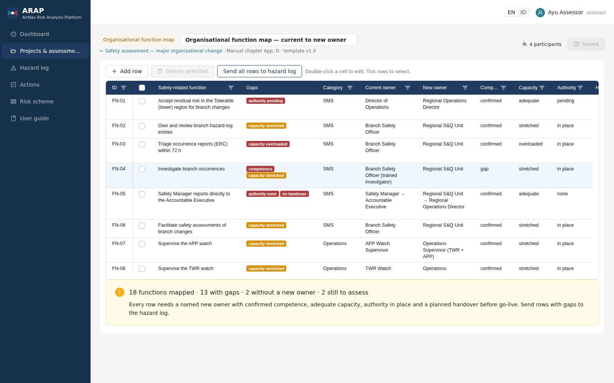

| Study | Pre-filled content |
|---|---|
| Organisational function map | 18 safety-related functions: SMS roles, supervision, training and competence, technical functions and bowtie barrier owners, each with current owner → new owner. Competence, capacity, authority and handover start as *unknown*. The **Gaps** column flags orphans (no new owner), competence gaps, stretched or overloaded capacity, pending authority, missing handover and anything still to assess. Rows with gaps can be sent to the hazard log. |
| FHA | Failure conditions of the organisational functions: triage delayed, investigations degraded, safety function not independent, merged supervisor overloaded, LoAs without an owner, and so on |
| STPA × 2 | The **current** and the **new** control structure, so you can compare the feedback loops. The new one includes unsafe control actions (UCAs) and loss scenarios. |
| HAZID | Uses its own **organisational guidewords**: roles, authority, competence, workload, interfaces, communication, corporate memory, contractors, culture, transition. Coverage is counted against this list. |
| HTA | The merged Operations Supervisor post, with a plan that sets priorities between watch, OJT and events |
| Delphi | The question and panel for the likelihood of triage failure after transfer |
| SWIFT, bowtie | What-ifs for the transition plan; the top event "safety-related function not performed, or performed without competence, capacity or authority", with phased go/no-go and reversion |
| SPI register | 10 indicators with target, alert level, owner and escalation. Rows at red are listed at the top. |
| GSN | G0–G7, linked to all the studies above |

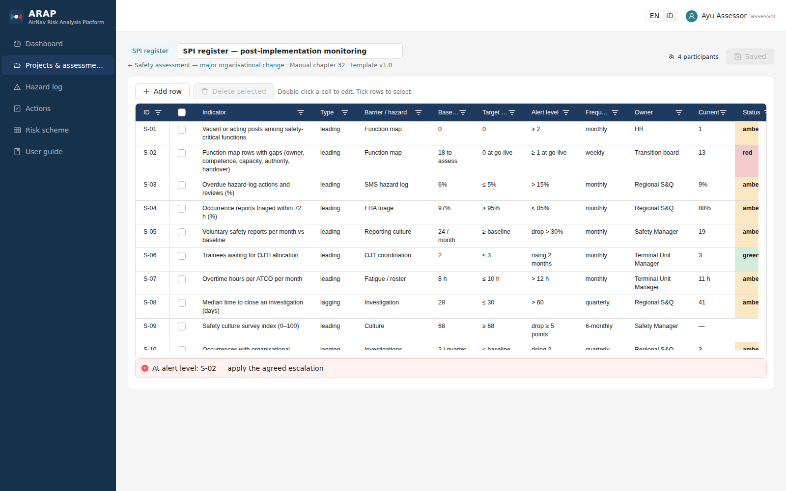

Demo project **DEMO-05** is this template filled in for an illustrative branch reorganisation. It has 13 of 18 functions with gaps (2 orphans), the Safety & Quality function losing its direct line to the Accountable Executive, a Delphi estimate converging on 0.12, SPI values, 7 hazards and 6 actions.

The same modules can be added to any assessment on their own: **Organisational function map** and **SPI register** appear in **Add study**.

### 3.5 Archiving and deleting a project

A project you no longer need can be **archived** or, by an administrator, **deleted**. The buttons are at the top right of the project page.

| | Archive | Delete |
|---|---|---|
| Who | Assessors, reviewers and administrators | Administrators only |
| What happens | The project and its assessments disappear from the project list and the assessment list. Its hazards and actions stay in the hazard log, the action list and the dashboard, because they may still be live. Every record is kept and can still be opened by its link. No new assessments can be added. | The project and all its assessments, studies, hazards, controls and actions are removed permanently. |
| Undo | **Restore** on the project page | Not possible |
| When refused | — | If any assessment has been endorsed, accepted, closed or superseded. Those are safety records; archive the project instead. |
| Audit trail | "archive" / "restore" | "delete", with the project details and the number of records removed |

**To archive:** open the project and click **Archive**. A yellow banner shows that the project is archived. To find it again, switch on **Show archived** above the project list; archived projects carry an *archived* tag. Open it and click **Restore** to make it active.

**To delete:** sign in as an administrator, open the project and click **Delete**. Type the project code exactly (for example `TRIAL-01`) and click **Delete permanently**. The button stays disabled until the code matches. ARAP then returns to the project list and reports how many assessments, studies, hazards and actions were removed.

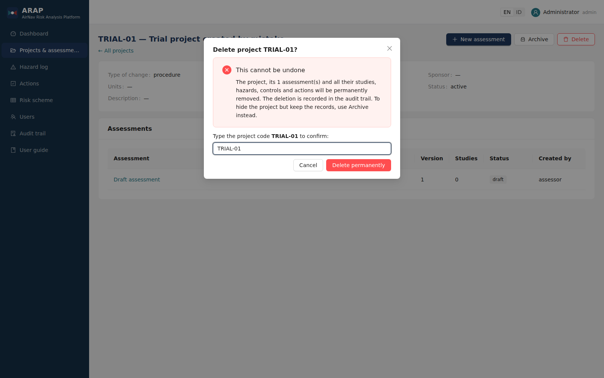

Use delete for projects created by mistake, test projects and the demo projects. A deleted demo project is not re-created when ARAP restarts. For a real change that has been cancelled or completed, archive it: the assessment is part of the safety record.

## 4. Working in a method study

Every study page has the same header:

- The **method** tag and the **study title** (editable).
- A link back to the assessment, the Manual chapter for the method and the template version.
- The number of **participants** recorded.
- **Save**. Changes are not saved automatically: the button reads *Save* while there are unsaved changes and *Saved* afterwards. If you try to leave the page with unsaved changes ARAP asks you to confirm.

When the assessment is endorsed, accepted or closed, or if your role cannot edit, the study opens **read-only** and a blue banner says so.

### 4.1 Sending results to the hazard log

Every method has a **Send to hazard log** button. It creates a hazard-log entry for each selected worksheet row (or for the bowtie as a whole, or for each STPA hazard), carrying over the causes, consequences, controls and any severity and likelihood. Sending the same row again **updates** the existing hazard rather than creating a duplicate. A message lists the hazard references created, e.g. `HZ-0007, HZ-0008`. Rate the risk and complete the controls in the [hazard log](#13-the-hazard-log).

---

## 5. Worksheet methods

HAZID, HAZOP, JHA, FMEA/FMECA and FHA use a spreadsheet-style worksheet.

**Editing the worksheet**

- **Double-click** a cell (or press Enter) to edit it; press Enter or click elsewhere to finish.
- Columns with fixed values — severity, likelihood, guideword, control type, failure type — show a drop-down list.
- **Add row** appends a row with the next ID (`HZ-06`, `HP-04`, …).
- Tick the checkboxes on the left to select rows, then **Delete selected** or **Send … to hazard log**.
- Click a column header to sort; use the filter icon to filter.
- The **Risk** column is computed from severity and likelihood using the current risk matrix.

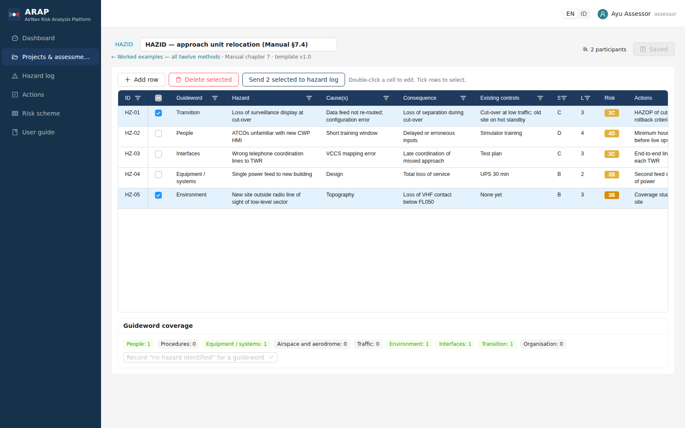

### 5.1 HAZID (Manual §7)

Work through the guidewords (People, Procedures, Equipment/systems, Airspace and aerodrome, Traffic, Environment, Interfaces, Transition, Organisation). The **Guideword coverage** panel below the worksheet shows how many rows each guideword has. When a guideword produces nothing, record that explicitly with **Record “no hazard identified”**. Use the *Needs method* column to flag rows that need a detailed method.

### 5.2 HAZOP (Manual §8)

1. In **Nodes and design intent**, add a node per procedure step or message exchange (**+ Node**), choose its type (*procedural* or *data-flow*) and write the design intent.
2. Press **Deviations** on a node. Choose the parameters and guidewords; ARAP adds one worksheet row per combination (e.g. *Message — No / Not*).
3. For each row either tick **N/A** (not meaningful) or record causes, consequences, safeguards, S, L and a recommendation.
4. The **Progress** column counts rows analysed out of rows generated.

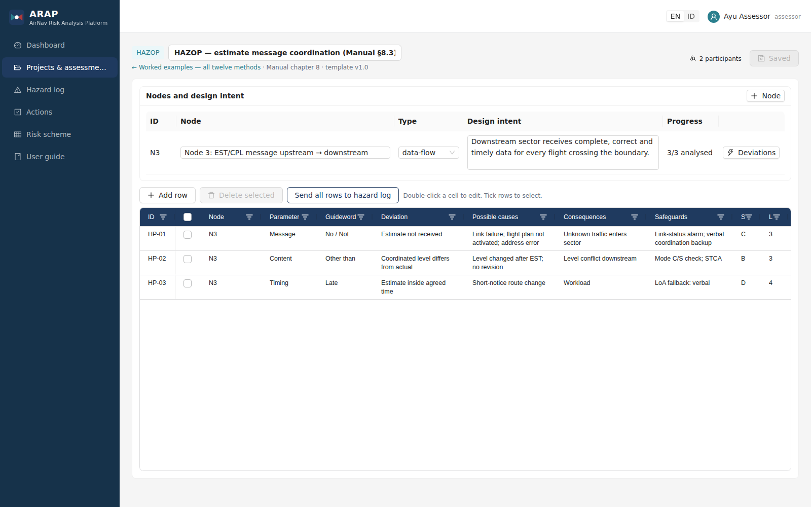

### 5.3 JHA (Manual §9)

Fill in the job header (job, location, permits), then one row per job step with its hazards, controls, control type and the person responsible. ARAP warns when a step relies only on **Administrative** controls or **PPE**, the lowest levels of the hierarchy of controls.

### 5.4 FMEA / FMECA (Manual §10)

One row per failure mode: item, failure mode, cause, end effect on the ATS, detection, compensation, and **S**, **O**, **D** ratings (1–10). ARAP computes the **RPN** (S × O × D), colours high values and sorts by RPN. It also lists high-severity modes (S ≥ 8) so they are not missed because of a low RPN. For FMECA, add the failure rate λp, mode ratio α, conditional probability β and operating time t.

### 5.5 FHA (Manual §12)

One row per failure condition: the function, the failure type (total loss, partial loss, erroneous detected/undetected, unintended, delayed), the condition, the operational effect and the **severity**. The **Safety objective** column is computed from the risk scheme: the maximum frequency per operating hour that keeps the failure condition at or better than *Tolerable (lower)* (Manual Table 12.1). Record the derived safety requirements in the last column.

---

## 6. Bowtie analysis

The bowtie editor draws the diagram automatically: threats on the left, the top event in the centre, consequences on the right, barriers in order on each line and escalation factors below the barrier they weaken.

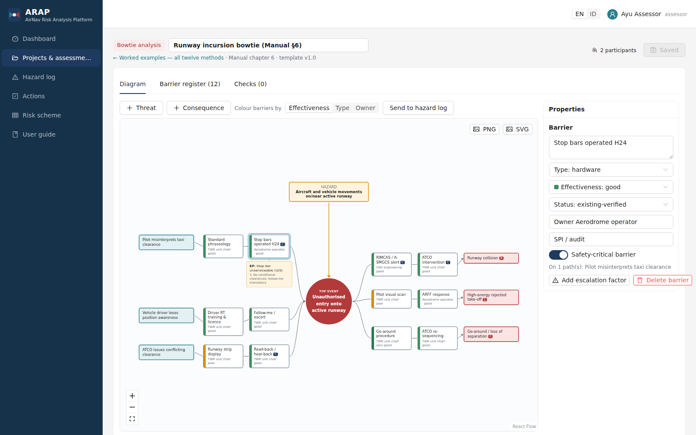

**Building the bowtie**

1. Click the **HAZARD** box and the **TOP EVENT** circle to edit their text. Phrase the top event as the moment control is lost, *before* any damage.
2. **+ Threat** and **+ Consequence** add lines. Click one to edit its text (and a consequence's severity).
3. With a threat or consequence selected, the **Properties** panel lists its barriers in order:
   - **New barrier on this path** adds a barrier;
   - **Add an existing (shared) barrier** puts a barrier that already exists on this line too — a shared barrier shows **×n**;
   - the arrows reorder barriers and the bin removes a barrier from this line only.
4. Click a **barrier** to set its type, effectiveness, status (existing-verified, existing-unverified, planned), owner, SPI/audit reference and whether it is **safety-critical** (**C** badge).
5. With a barrier selected, **Add escalation factor** attaches a condition that degrades it. Select the escalation factor to write its escalation-factor barriers, one per line.

**Viewing**

- **Colour barriers by** effectiveness (default), type or owner.
- Zoom with the mouse wheel or the + / − controls; drag the background to pan; the frame icon fits the diagram.
- **PNG** and **SVG** download the full diagram as an image.
- **Barrier register** lists every barrier with its attributes (Manual §6.3).
- **Checks** lists issues: a top event phrased like a consequence, lines with fewer than two barriers, barriers without an owner.

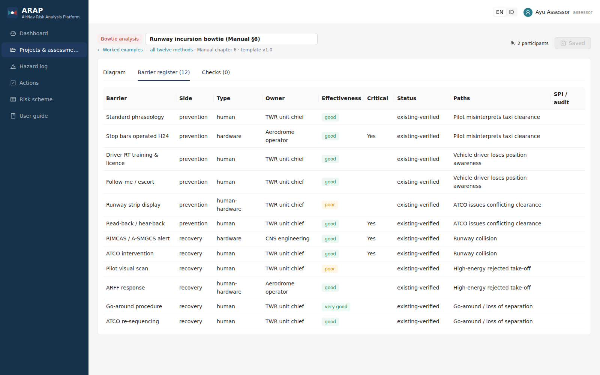

---

## 7. LOPA

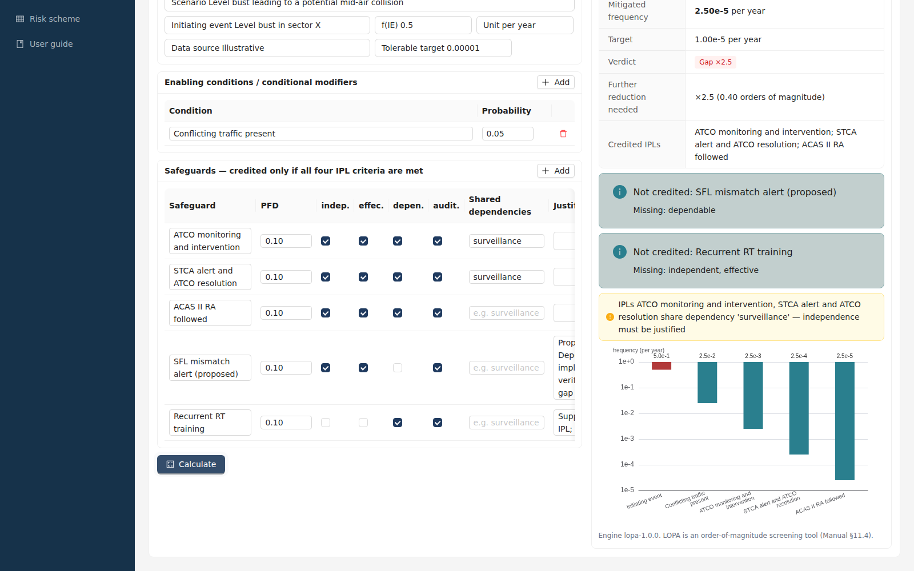

1. Describe the **scenario**, the **initiating event**, its frequency, unit and data source, and the **tolerable target** frequency.
2. Add **enabling conditions / conditional modifiers** with their probabilities.
3. Add **safeguards** with a probability of failure on demand (PFD). Tick each of the four IPL criteria — *independent, effective, dependable, auditable* — only if it is justified, and write the justification. A safeguard is credited **only if all four are ticked**.
4. Record shared dependencies (e.g. `surveillance`) — ARAP warns if two credited layers share one.
5. Press **Calculate**. The result shows the mitigated frequency, the verdict (*Target met* or *Gap ×n*), the extra risk reduction needed, the safeguards not credited and why, and a log-scale chart of the frequency after each layer.

In the demo study the proposed *SFL mismatch alert* is not yet ticked *dependable*, so the result shows a gap of ×2.5. Tick it and recalculate to see the target met (2.5 × 10⁻⁶ per year).

---

## 8. Fault tree analysis

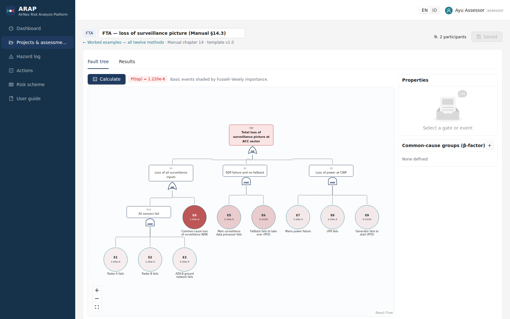

**Building the tree**

- Click a gate and use **OR gate**, **AND gate**, **Basic event** or **Undeveloped** in the Properties panel to add inputs. **Reuse an existing node as input** links a node already in the tree (e.g. a shared support system).
- For a **vote** gate set *k* (k-out-of-n).
- For a **basic event** give either a probability *p*, or a failure rate λ with an exposure time *t* (P = 1 − e^(−λt)), a repair time MTTR (repairable unavailability), or a test interval T (periodically tested standby, λT/2).
- A **house event** is a switch set to TRUE or FALSE.
- **Common-cause groups** apply the β-factor model to a set of basic events.

**Calculating**

Press **Calculate**. The top-event probability appears above the tree, and basic events are shaded by their Fussell–Vesely importance. The **Results** tab gives:

- the exact top-event probability (binary decision diagram), the rare-event approximation and the min-cut upper bound;
- single points of failure;
- minimal cut sets with probability and share;
- Birnbaum and Fussell–Vesely importance for every basic event.

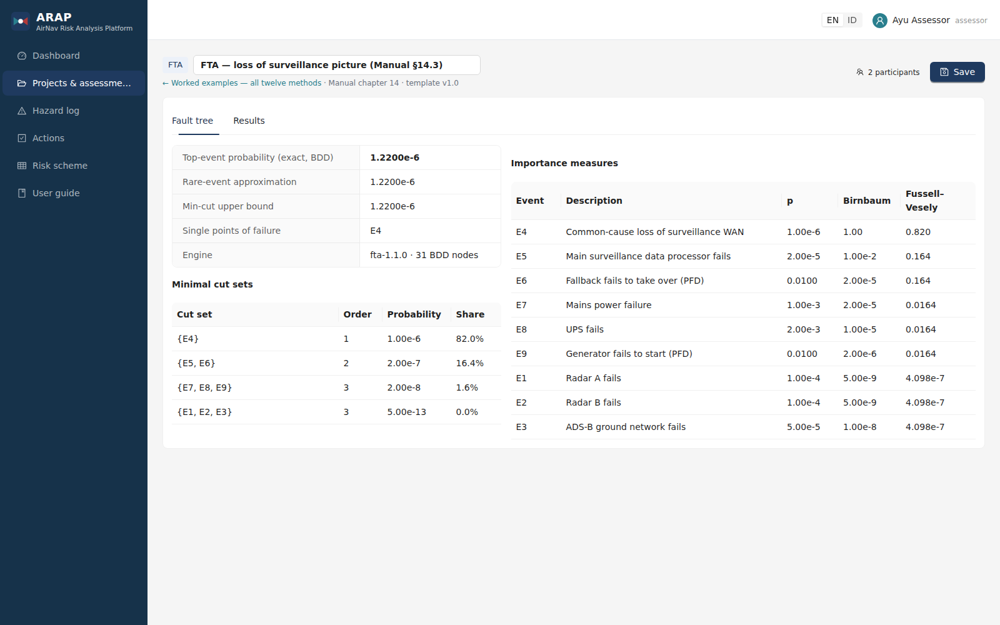

---

## 9. Fatigue modelling

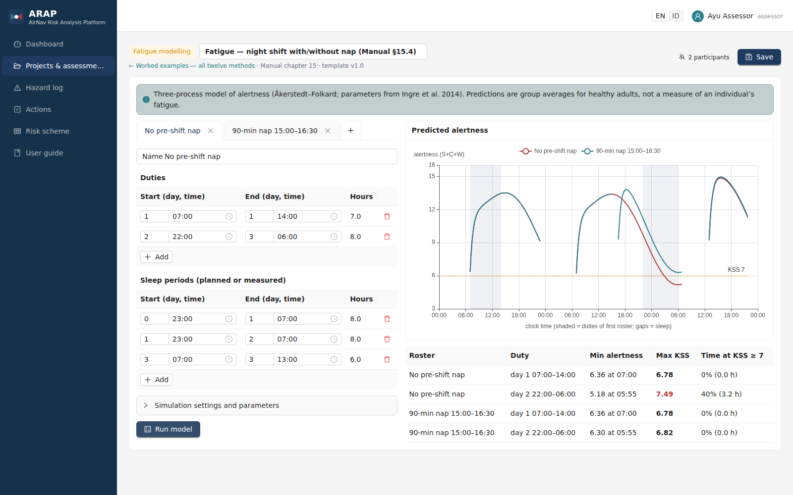

1. Each tab is a **roster variant** (e.g. *No pre-shift nap* and *90-min nap*). Use **+** to copy the first roster into a new variant.
2. Enter **duties** and **sleep periods** as day number and clock time. Day 1 starts at 00:00; a sleep starting at 23:00 the evening before day 1 is entered as day 0, 23:00.
3. **Simulation settings and parameters** sets the number of days, time step, KSS threshold and, if needed, the model parameters (leave blank for the defaults of the Manual, §15.2).
4. Press **Run model**. The chart shows predicted alertness for each variant (gaps are sleep; shaded bands are duties of the first variant; the dashed line is the KSS threshold). The table gives, per duty, the minimum alertness and when it occurs, the maximum KSS, and the time spent at or above the threshold.

> Predictions are group averages for healthy adults. They are not a measure of an individual's fatigue and must be checked against operational data (Manual §15.5).

---

## 10. Bayesian belief networks

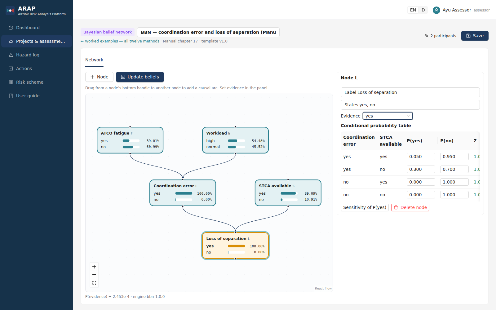

**Building the network**

- **+ Node** adds a node; drag nodes to arrange them.
- To add a causal arc, drag from the **bottom handle** of the cause to the effect node. Double-click an arc to remove it. ARAP rejects cycles when calculating.
- Select a node to edit its label and **states** (comma-separated) and its **conditional probability table** — one row per combination of parent states. Each row must sum to 1; the Σ column turns red when it does not (for two-state nodes the second value fills in automatically).

**Using the network**

- **Update beliefs** calculates every node's probabilities; the bars inside the nodes show them.
- Select a node and choose a state under **Evidence** to condition on it (the node turns amber). All other nodes update — this is how you ask diagnostic questions such as *given a loss of separation, how likely was fatigue?*
- **Sensitivity** shows how much each other node can move the selected node's probability (tornado chart).

---

## 11. STPA

The STPA study follows the four steps of the STPA Handbook, one tab each.

1. **Purpose** — losses, system-level hazards (linked to losses) and system-level constraints (linked to hazards).
2. **Control structure** — add controllers, automation and controlled processes; drag from a box's bottom/right handle to another box to add an arrow. Choose whether new arrows are **control** actions (solid) or **feedback** (dashed). Click a box to write its *process model*; click an arrow to rename it.

   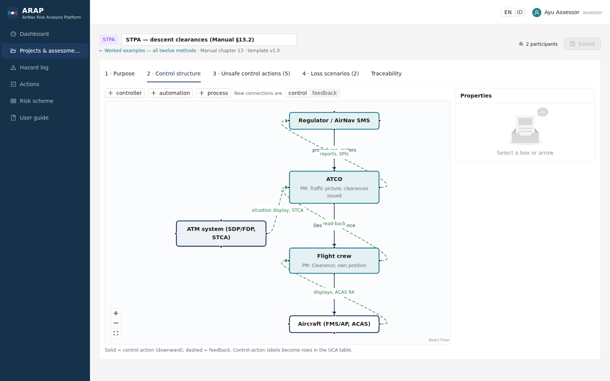

3. **Unsafe control actions** — for every control action, four columns (*not providing*, *providing*, *too early/too late/wrong order*, *stopped too soon/applied too long*). Add UCAs with **+ UCA**; each needs a context (“when …”) and at least one hazard, otherwise ARAP warns.

   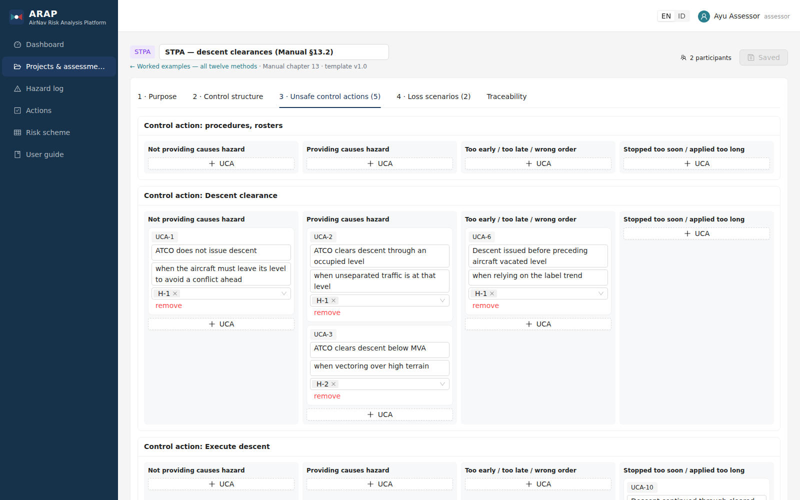

4. **Loss scenarios** — for each UCA, the scenario type, description and the resulting requirement or constraint. **Send hazards to hazard log** creates one hazard-log entry per STPA hazard.
5. **Traceability** — the chain loss → hazard → constraint/UCA → scenario → requirement, with broken chains flagged.

---

## 12. FRAM

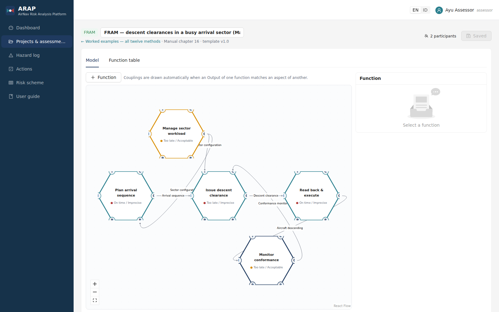

- **+ Function** adds a function (hexagon). Drag to arrange.
- Select a function to set its name, type (human, technological, organisational) and the six **aspects** — Input, Output, Precondition, Resource, Control, Time. Type an entry and press Enter; existing outputs are offered as suggestions.
- **Couplings are drawn automatically** wherever an Output of one function has the same text as an aspect of another. Unmatched aspects are listed so you can fix typos or add missing functions.
- Record the **output variability** (timing: too early / on time / too late / not at all; precision: precise / acceptable / imprecise). The dot colour on each hexagon shows it.
- The **Function table** tab lists everything in one table.

---

## 13. Extended methods (Manual chapters 18–31)

Version 0.2 adds thirteen methods, and version 0.3 adds the wildlife strike module. They all work like the others: open the study, edit, press **Calculate** where there is one, and **Save**. The demo project **DEMO-02** has one worked example of each, matching the Manual.

### 13.1 Collision risk — CRM (Manual §18)

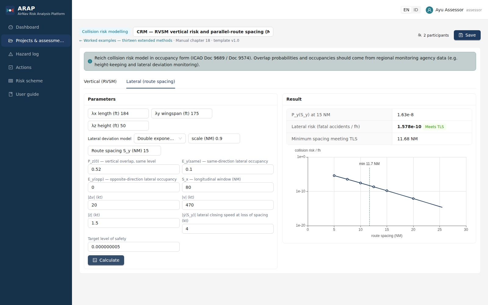

Two tabs. **Vertical (RVSM)** takes the Reich-model parameters: overlap probabilities, occupancies, speeds and aircraft dimensions (entered in feet). **Calculate** shows the same- and opposite-direction risk, the total and whether it meets the target level of safety (TLS). **Lateral (route spacing)** also asks for the lateral-deviation model (double exponential or Gaussian) and its scale. It plots risk against route spacing on a log scale and gives the **minimum spacing** that meets the TLS. The demo gives 1.87 × 10⁻⁹ (vertical) and 11.7 NM (lateral).

### 13.2 Event tree analysis — ETA (Manual §19)

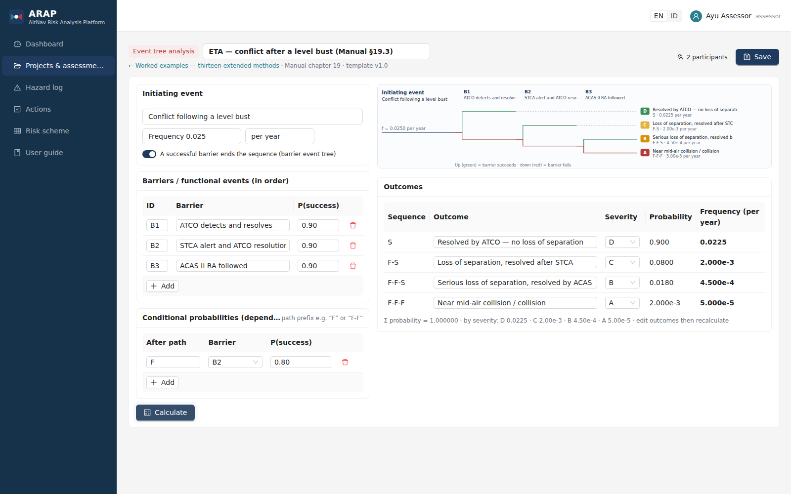

1. Enter the initiating event and its frequency.
2. List the barriers **in the order they act**, with their probability of success.
3. Under **Conditional probabilities**, enter any dependence as a path prefix. For example, `F` / `B2` / 0.8 means "STCA succeeds 80% of the time when the controller has already failed".
4. Press **Calculate**. ARAP draws the tree and lists each sequence with its probability and frequency.
5. Name each outcome and give it a severity, then recalculate. The totals by severity appear under the table.

### 13.3 Human reliability — HRA (Manual §20)

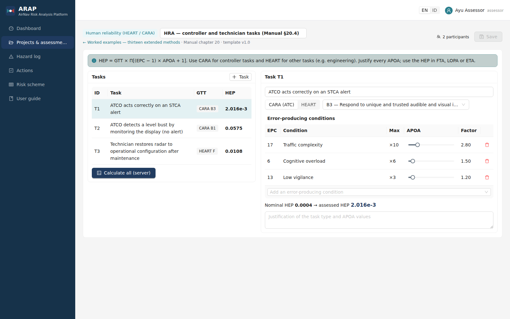

Add a task and choose **CARA** (controller tasks) or **HEART** (other tasks) and the generic task type. Add error-producing conditions from the list. For each one, set the **APOA** slider (0–1) and write a justification. The HEP updates as you edit. **Calculate all** runs the server engine for the record.

### 13.4 Occurrence risk classification — ERC and RAT (Manual §21)

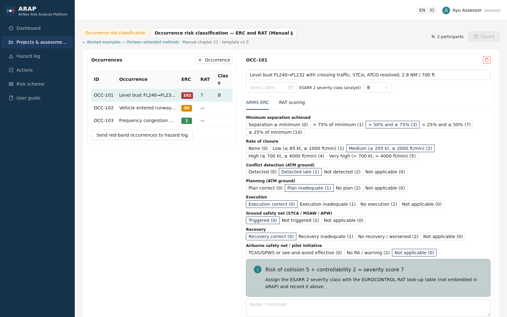

- **Add an occurrence.** Add a short description, date and occurrence ID.
- **ARMS ERC.** Click the matrix cell that answers Q1 (most credible accident outcome) and Q2 (effectiveness of the remaining barriers). The band and recommended response are shown.
- **RAT scoring.** Pick one answer per item. ARAP adds the points for risk of collision and controllability. Record the ESARR 2 severity class that you read from the EUROCONTROL RAT table.
- **Send red-band occurrences to hazard log.** Creates hazard entries for the red-band occurrences.

### 13.5 Safety argument — GSN (Manual §22)

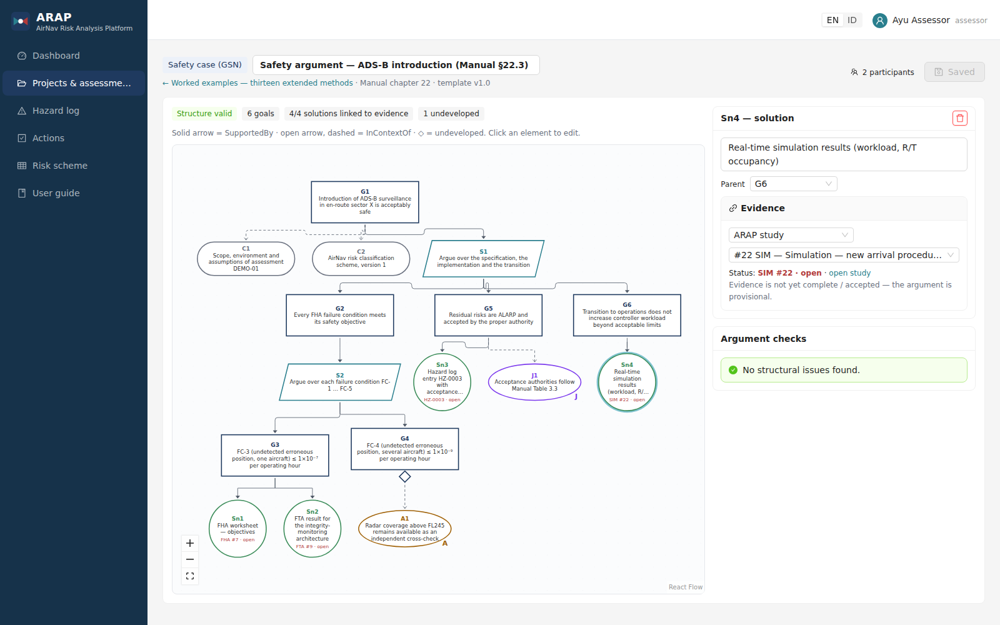

- **Build the argument.** Click an element to edit it. Use **+ goal / + strategy / + solution / + context / + assumption / + justification** to add elements below it. ARAP lays out the diagram automatically.
- **Link evidence.** For a **solution**, link the evidence: an ARAP study, a hazard log entry or an external document. The solution shows the evidence status in green (complete or accepted) or red (still provisional).
- **Argument checks.** This panel lists structural problems: more than one top goal, unsupported goals, strategies supported by something other than goals, solutions without evidence, and cycles. Mark a goal **undeveloped** when its support is still to come.

### 13.6 Common cause analysis — CCA (Manual §23)

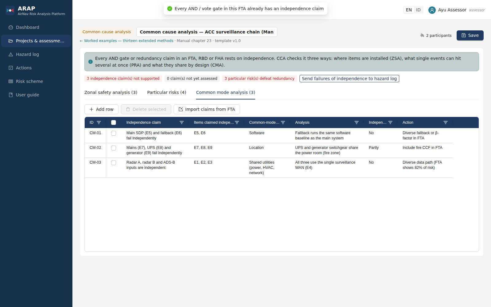

Three worksheets: **Zonal safety analysis**, **Particular risks** and **Common mode analysis**. On the common-mode tab, **Import claims from FTA** creates one independence claim for every AND or k-out-of-n gate in a chosen fault tree. For each claim, record the common-mode source and whether independence holds. The tags at the top count unsupported claims and particular risks that defeat redundancy. **Send failures of independence to hazard log** passes them on.

### 13.7 RBD and Markov (Manual §24)

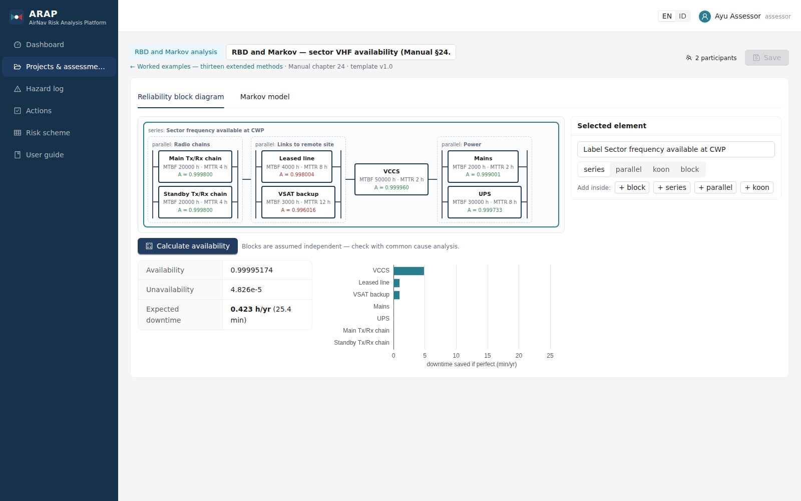

- **RBD tab.** Click a group or block to edit it. Groups can be **series**, **parallel** or **k-out-of-n**. Blocks have MTBF and MTTR. Add elements inside a group with the **+** buttons.
- **Calculate availability.** Gives availability, unavailability and downtime per year, plus a chart of how many minutes a year each block would save if it were perfect.
- **Markov model tab.** Define states (tick *Service up?*) and transitions with rates per hour, then press **Solve**. You get steady-state probabilities, availability, failure frequency, system MTBF, mean down time and mean time to first failure.

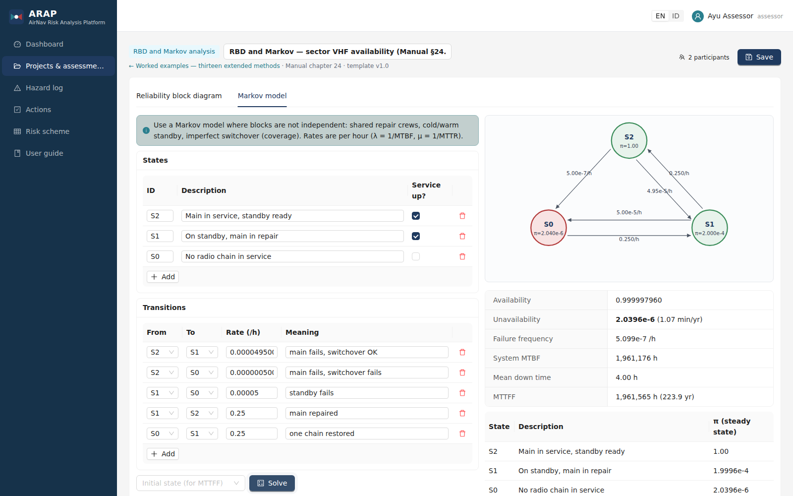

### 13.8 SWIFT (Manual §25)

A worksheet like HAZID. Each row is a *what if…?* question under a prompt category, with consequence, safeguards, severity, likelihood and recommendation. **Prompt category coverage** shows which categories have been considered. Use it to record "considered — nothing credible" for the rest. Rows with a consequence can be sent to the hazard log.

### 13.9 Hierarchical task analysis — HTA (Manual §26)

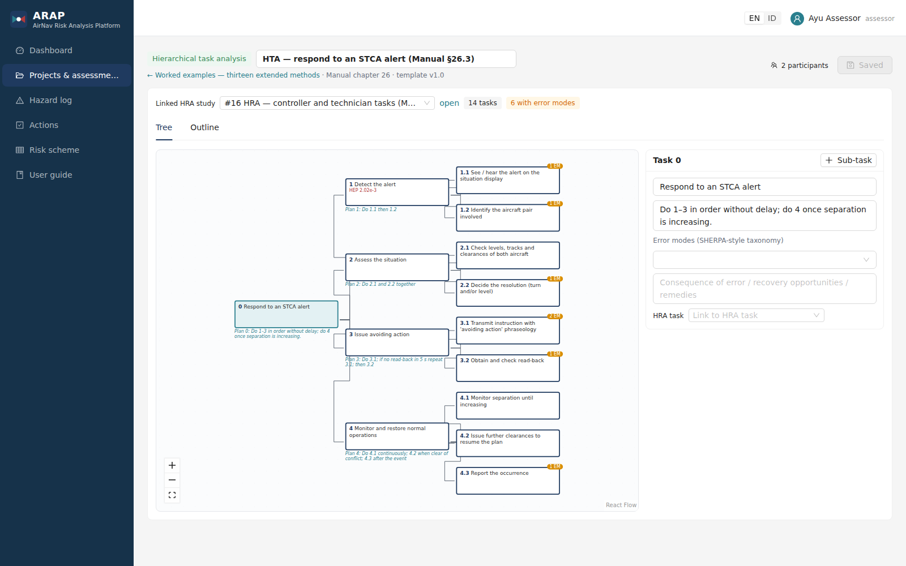

- **Build the hierarchy.** Select a task and press **Sub-task** to add a step below it. Numbering is automatic (1, 1.1, 1.2 …).
- **Add plans.** Write a **plan** for every task that has sub-tasks. Tasks without one are flagged in red.
- **Record error modes.** Add error modes to bottom-level tasks.
- **Link to HRA.** Choose a **linked HRA study** at the top, then link a task to one of its HRA tasks to show the HEP.
- **Change the view.** The **Outline** tab shows the same content as an indented table.

### 13.10 Simulation (Manual §27)

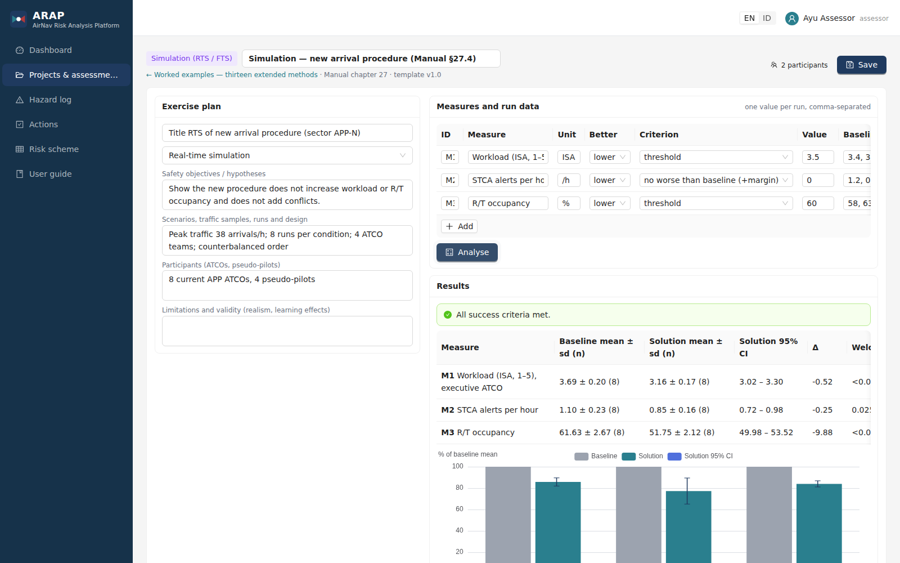

- **Plan the exercise.** Record the exercise plan: objectives, scenarios, participants and limitations.
- **Define the measures.** For each measure, set whether lower or higher is better and a **criterion**. Use *threshold* (e.g. ≤ 3.5), or *no worse than baseline*, which takes an optional margin. Set the criteria **before** entering results.
- **Enter the run results.** Enter them as comma-separated numbers for the baseline and the solution.
- **Analyse.** You get the mean, standard deviation, 95% confidence interval, Welch's t-test and whether each criterion is met. You can send failed criteria to the hazard log.

### 13.11 Expert judgement (Manual §28)

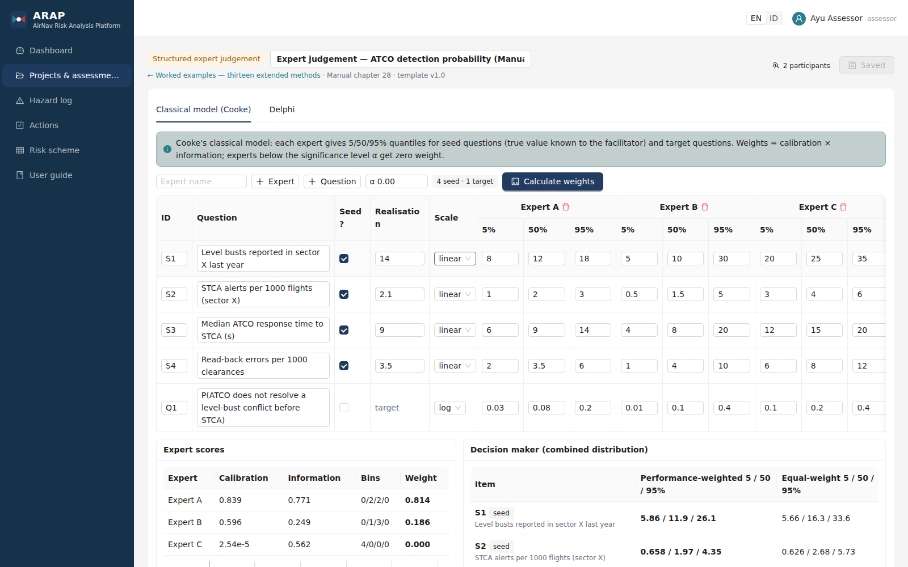

- **Classical model (Cooke).**
  1. Add experts and questions.
  2. Tick **Seed?** for calibration questions and enter the true value.
  3. Enter each expert's 5%, 50% and 95% values. Quantiles that are incomplete or not increasing are flagged.
  4. Press **Calculate weights** to get calibration, information and weight per expert, and the combined (decision-maker) distribution for every question.
- **Delphi.** Add panellists and rounds and enter the estimates, then press **Summarise rounds** to see the median, quartiles and convergence per round.

### 13.12 Security risk (Manual §29)

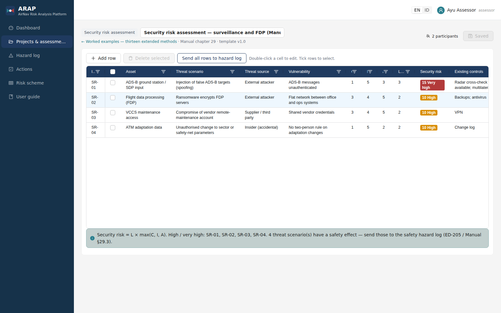

A worksheet of threat scenarios: asset, threat, source, vulnerability, C/I/A impact (1–5), likelihood (1–5), controls, treatment and owner. **Security risk** = likelihood × the highest of C, I and A, shown as Low / Medium / High / Very high. Give each scenario a **safety effect** (severity A–E) where it has one. Only those rows are sent to the safety hazard log, so exploit details stay in the security study.

### 13.13 Occurrence investigation — SOAM, HFACS, Tripod Beta (Manual §30)

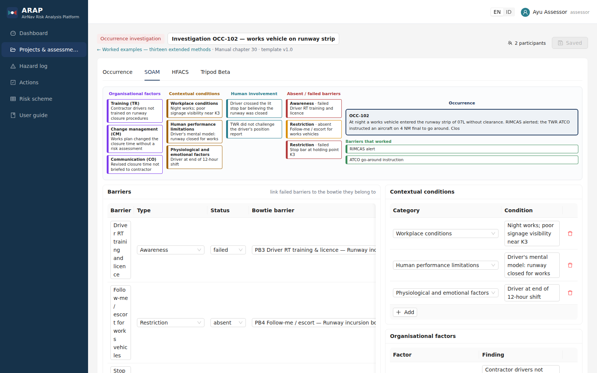

- **Occurrence** — the facts, the counts of failed barriers, HFACS categories and actions, and **Send occurrence to hazard log**.
- **SOAM** — barriers (type and status), human involvement, contextual conditions, organisational factors and safety actions. The SOAM chart updates as you type. Link each failed or absent barrier to the **bowtie barrier** it corresponds to. The bowtie then shows "recorded as failed in N investigation(s)" when you select that barrier.
- **HFACS** — tick categories in the four tiers and record the evidence for each.
- **Tripod Beta** — event trios (agent, object, event) with failed or missing barriers traced to immediate cause, precondition, underlying cause and Basic Risk Factor. A BRF profile summarises them.

### 13.14 Wildlife strike risk — species matrix (Manual §31)

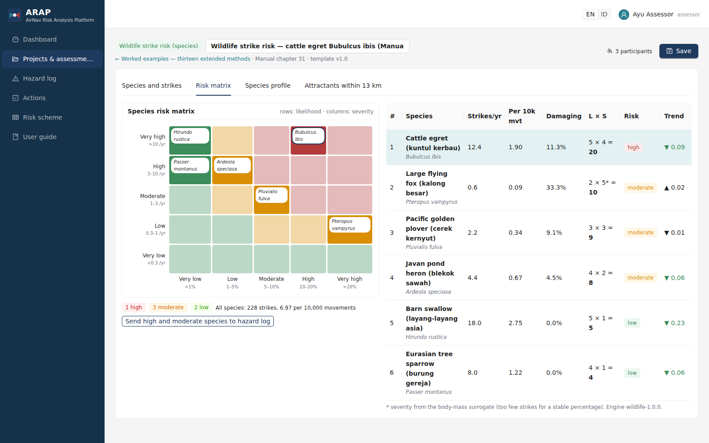

- **Species and strikes.** Enter the review years and the aircraft movements for each year. Then add one row per species, or per group of similar species: common and scientific name, body mass, whether it flocks, and the strikes and damaging strikes for each year. Press **Calculate risk**.
- **Risk matrix.** Each species is placed on a 5 × 5 grid. Rows are likelihood (mean strikes per year) and columns are severity (share of strikes that caused damage or had an effect on flight). The ranking table adds the rate per 10,000 movements and its trend. A species with fewer than 5 strikes gets its severity from body mass, plus one class if it flocks; ARAP marks this with \*. Use **Send high and moderate species to hazard log** to create hazard entries, with the species' attractants and measures.
- **Species profile.** For the selected species: ecology notes, time of day of strikes, a year-by-year chart of strikes and strike rate, a monthly chart of survey counts and strikes (use **Edit** to enter counts), and the species management measures with type, owner and status.
- **Attractants within 13 km.** A register of wildlife attractants: landfills, tambak, rice fields, roosts, grazing land and so on. Each entry has a distance, the species it attracts, an action and an owner. Sites inside the 13 km circle are flagged.

The worked example in **DEMO-02** uses the cattle egret, *Bubulcus ibis*. It has 62 strikes in five years, 7 of them damaging, which gives 5 × 4 = 20 (high). It ranks above the barn swallow, which is struck more often but almost never causes damage.

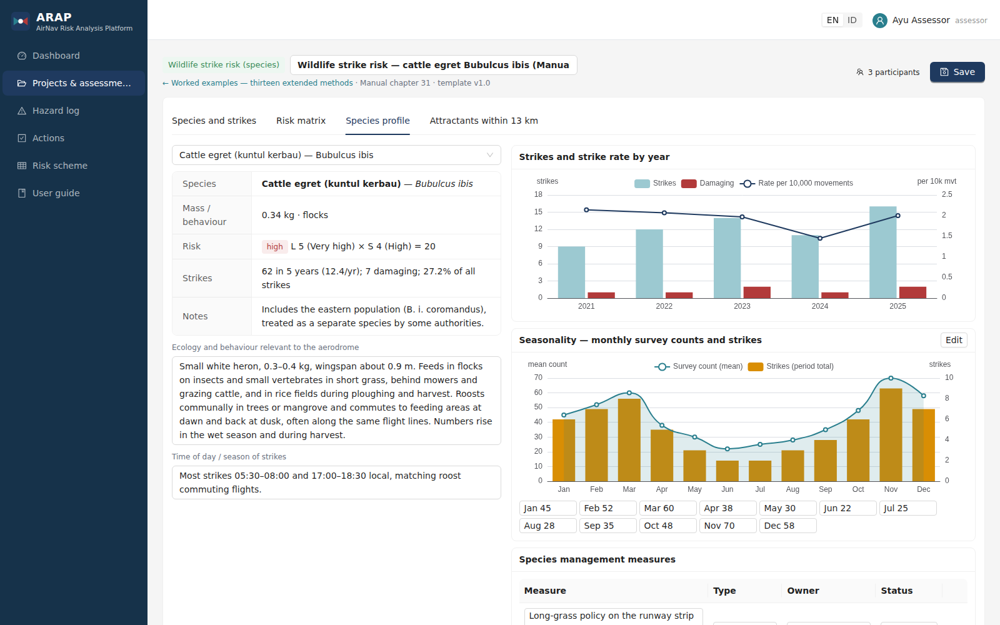

### 13.15 Case study: H24 alternate aerodromes (DEMO-03)

The project **DEMO-03** reproduces a real-format Safety Risk Assessment, *SRA/MOC/OPS/001/IX/2026 Rev 00 — Assessment Operasi 24 Jam Aerodrome Alternate*. It covers activating H24 ATS at seven alternates (WAHI, WAHH, WAHQ, WAHS, WICA, WICC, WIPP) when an eruption of Gunung Anak Krakatau closes WIII. The content is kept in Bahasa Indonesia, as in the source report.

| ARAP item | What it holds |
|---|---|
| Assessment scope, environment, assumptions | The change, system boundary, scenarios S1–S3, demand derivation (72-aircraft design wave), feasibility-gate and capacity-model results, and the assumption register A-01 to A-12 |
| HAZID study *Register risiko* | The 40 hazards from FHA (F1–F7), HAZOP and STPA with their current rating, existing barriers and mitigations |
| STPA study | The four-organisation closure/reopening decision chain (VAAC → AirNav → operator bandara → KOBU → INMC), six unsafe control actions and their loss scenarios |
| Two FTA studies | ATS power over 30 days: single untested genset 4.6 × 10⁻³, two tested gensets 2.9 × 10⁻⁴ |
| Bowtie | *Pesawat tidak dapat mendarat dengan selamat di aerodrome alternate*. New barriers M-xx are marked *planned*, with the SPI that monitors each one |
| GSN | Claim G0 with sub-claims G1–G7; five are *undeveloped* because they are waiting for preconditions |
| Hazard log | `ALT-G-01` … `ALT-S-03`. The initial rating is the report's *Current* column, the residual is the *Residual* column, and the *Inherent* rating is in the context field. Mitigations M-01 to M-20 are planned controls |
| Actions | `ALT-PK-1` … `ALT-PK-8`, the activation preconditions (PK-1, PK-3 and PK-4 are blocking) |

The feasibility gate and the capacity (queue/occupancy) model have no dedicated ARAP module yet, so their results are recorded in the assessment's environment text.

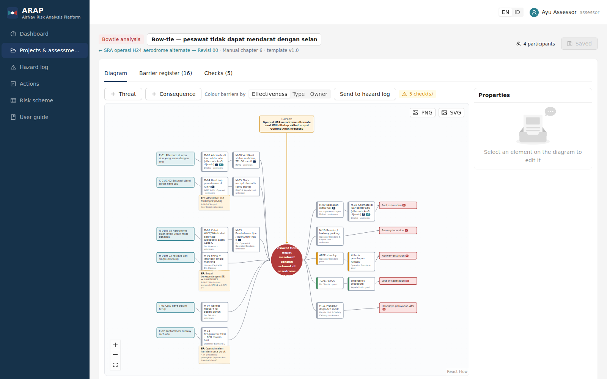

---

### 13.16 Investigation expert system and case library (Manual Appendix E)

The expert system helps in the **initial phase of an ATS occurrence investigation**. It finds similar past occurrences, compares the evidence you have with the evidence they needed, suggests the likely mechanism and — most usefully — lists the evidence worth collecting next. It is advisory: it suggests, investigators conclude, and its outputs do not apportion blame.

It has two parts:

- **Case library** (left menu). Past occurrences stored as AcciMaps in the five ORLIO lanes: Organisational influences, Risk controls, Local conditions, Individual actions, Occurrence events.
- **Investigation expert system (ORLIO)**, a study you add to the assessment of an investigation.

#### The case library

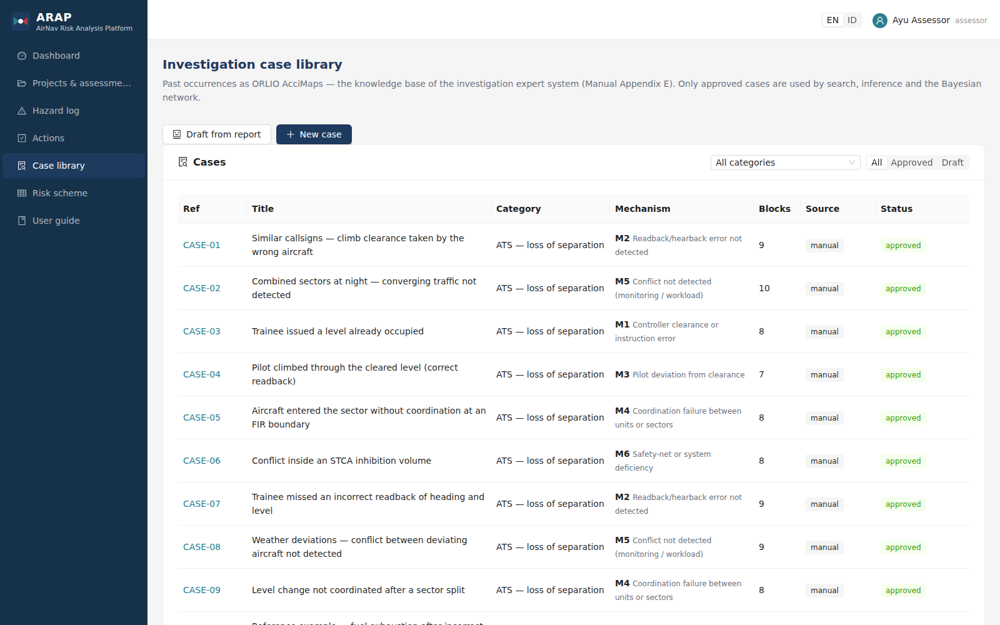

AcciMaps have a lane for *technical failure mechanisms* beside individual actions, and every catalogue factor shows its ATSB code (§13.17). Verbal probabilities use the ATSB terms: very unlikely, unlikely, about as likely as not, likely, very likely, virtually certain.

Each case has **evidence** blocks (facts, rated in the past occurrence), **hypothesis** blocks (intermediate conclusions) and one **finding** (the occurrence and a verbal probability for each mechanism of the category). Give each block an **ORLIO factor** from the category's catalogue where one fits: the factor links the block across cases and is what the Bayesian network learns from.

In the AcciMap editor:

- **+ Evidence / + Hypothesis / + Finding** add blocks. Click a block to edit it in the panel on the right.
- Drag from a block's lower handle to another block to link them. Click a link to make it an **input** (solid, used by the rules) or **context** (dashed, shown only). Drag a block into another lane to change its layer.
- **Default rules** creates, for each hypothesis and finding, the *confirming* rule (the past states → the past conclusion), a *weakening* rule per input (that input "No effect") and a *contradicting* rule per input (that input opposed). Edit them in the **Rules** tab. A yellow banner warns when the rules no longer match the links.
- The **Test** tab runs the inference with the past states; it should reproduce the past finding.

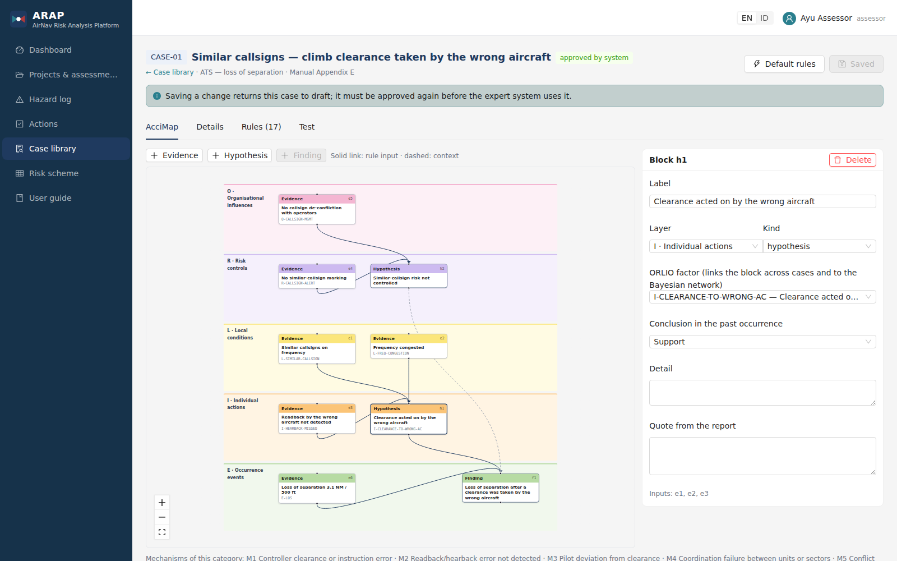

A case is used only after a **reviewer approves** it. Saving a change to an approved case returns it to draft.

**Draft from report** creates a draft AcciMap from pasted text or a text-based PDF of a final report:

- *Offline* (always available): sentences are matched to the factor catalogue and the mechanism keywords.
- *AI (Claude)*: available when the administrator has set `ARAP_ANTHROPIC_API_KEY`. Claude proposes the blocks, links and mechanism. **Only send published final reports**; protected investigation records must not leave AirNav.

Every drafted block carries a quote from the report, which ARAP checks against the text. A quote that is not found is marked in red and blocks approval until you correct or clear it; the **Report text** tab lists all quotes. Treat every draft as a starting point: check the layers, the past states and the links, and delete blocks that are not findings of the report.

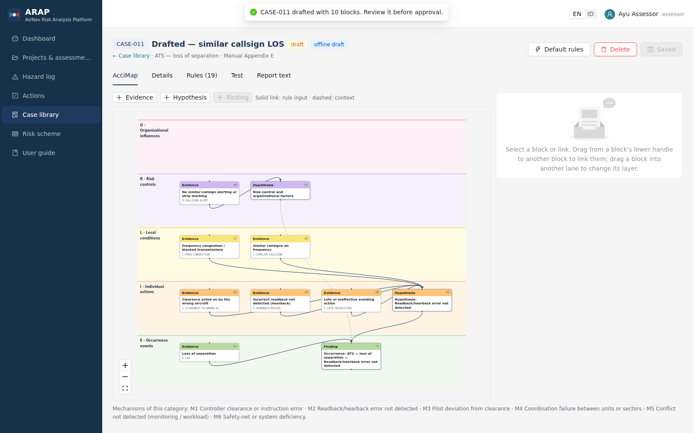

#### Using the expert system in an investigation

Add the study **Investigation expert system (ORLIO)** to the investigation's assessment, choose the occurrence category, and work through the four tabs:

1. **Occurrence & search.** Describe what is known so far and click **Search the case library**. Results show the matched terms and shared factors; tick up to five cases. Factors recognised in your text are shown as suggestions. Click one to rate it *Support*, but check it first.
2. **Evidence ratings.** Rate each factor you have evidence for: *Strongly support* or *Strongly oppose* for recorded or physical evidence (radar replay, RT recording, logs); *Support* or *Oppose* for interviews and judgement; *No effect* when the factor was present but did not matter. Use *Unsure* when evidence exists but its relevance cannot be judged yet. Leave everything else **Not provided**. A factor rated once applies to every case.
3. **AcciMaps.** Click **Run analysis**. Each selected case shows the inferred hypotheses and finding, or *not determined* when evidence is missing. **Clues from the past cases** lists that missing evidence. You can also rate evidence directly in the diagrams.
4. **Bayesian network & ranked clues.** This tab uses the whole approved library of the category. The bar chart shows the prior and posterior probability of each mechanism. The table ranks the unrated factors by **value of information**: how much establishing each would reduce the uncertainty about the mechanism. Rate a clue and run again. **Open as BBN study** creates an ordinary Bayesian-network study with the learned network and your ratings.

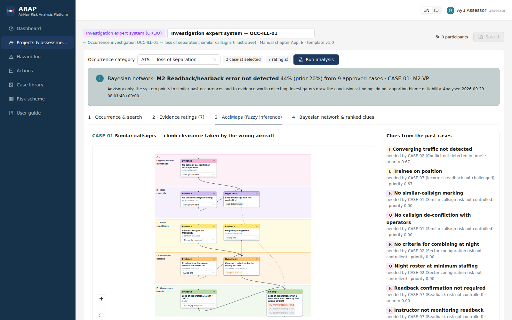

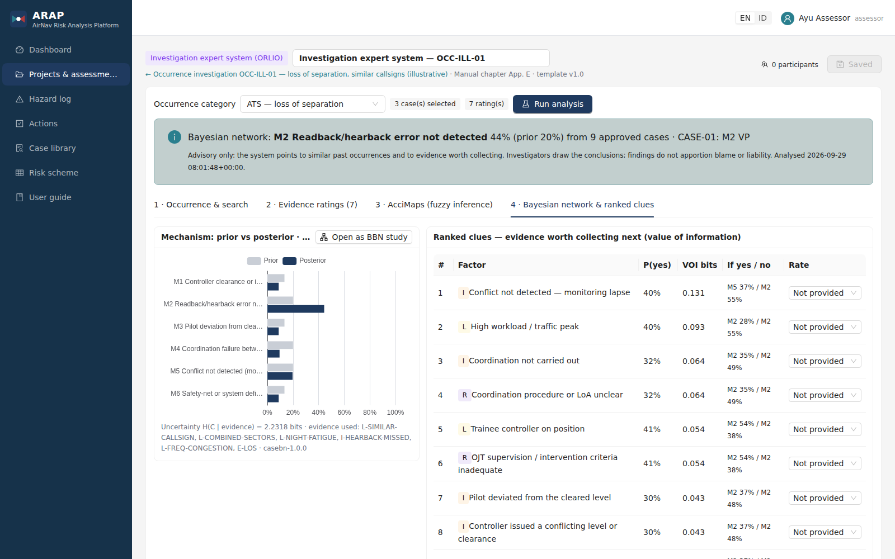

Demo project **DEMO-06** is an illustrative loss of separation between two aircraft with similar callsigns on combined night sectors. The library has nine illustrative ATS cases and the reference example from Ng et al. (2022).

After the day-1 ratings:

- The network puts *readback/hearback error not detected* (M2) at 44% (prior 20%).
- CASE-01 gives M2 *Very likely*.
- The top clue is whether the conflict went **undetected while monitoring**, which best separates M2 from *conflict not detected in time* (M5).

Continue the investigation with SOAM/HFACS (§13.13). After the final report, add the occurrence to the case library.

### 13.17 Safety investigation analysis — the ATSB method (Manual Appendix F)

This study carries an occurrence investigation from the sequence of events to the findings, safety issues and safety action, following the ATSB *Safety Investigation Guidelines Manual — Analysis* and its tools manual. Add **Safety investigation analysis (ATSB)** to the investigation's assessment. ARAP re-checks the analysis automatically about half a second after each change.

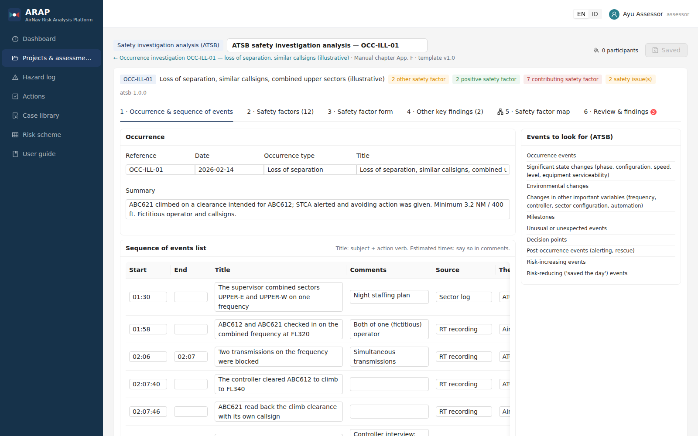

**1 · Occurrence & sequence of events.** Record the occurrence, then list the events. Each event needs a start time (estimate if necessary and say so in the comments) and a title written as a subject and an action verb. Theme groups events on the timeline (ATC, aircraft, crew). To put an event on the safety factors list, choose its type in the *Safety factor* column and click **Add**. The *Events to look for* list on the right is ATSB's prompt list.

**2 · Safety factors.** The master register: one row per potential safety factor with its type, codes, whether it is analysed further, existence, the **finding type** that ARAP derives, safety issue and risk level, and an *analysis complete* switch. Click an ID to open the factor.

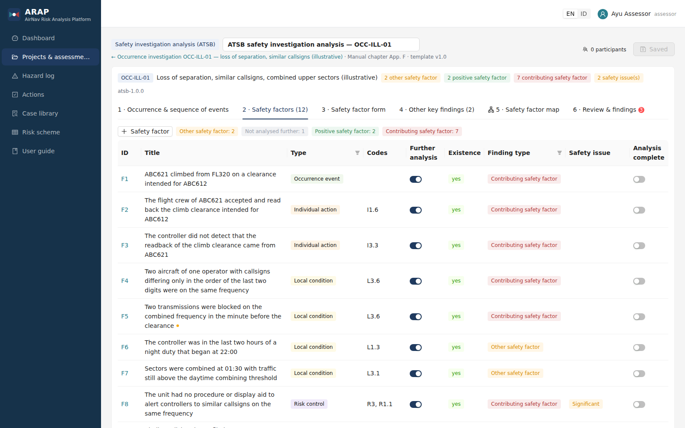

**3 · Safety factor form.** For the selected factor:

- **Define**: a complete, neutral sentence (no "failed", "inadequate"; one factor per statement); the type; one or more ATSB codes from the taxonomy (coding guidance appears for codes that have it); the role and error type for individual actions, the functional area for conditions, preventive or recovery for risk controls, internal or external for organisational influences. Tick *Potential safety issue* (local conditions, risk controls and organisational influences only) and name the owner. Untick *Analyse further* only with a reason.
- **Existence** and **Influence**: evidence tables. Rate each item *supports*, *opposes*, *no effect* or *unsure*, and record its source, type, relevance, credibility concerns and whether it was expected but not seen. Then conclude *supported* or *not supported* with a probability expression (a finding needs *likely*, 66 % or more). For influence, first choose what the factor influenced: the occurrence or another safety factor. The questions on the right are ATSB's checklist for the test.
- **Importance** (only when existence passed and influence did not): is the factor still worth analysing? Justify the decision.
- **Explain**: the factors whose influence is on this one; **Add an explaining factor** starts a new one already linked.
- **Risk analysis** (safety issues): worst possible scenario, existing controls, worst credible scenario, then click the matrix. Choose **AirNav 5×5** (default) or **ATSB 6×6**. Both give *critical*, *significant* or *broadly acceptable* (not a safety issue). The small matrix records an alternative rating for sensitivity.
- **Safety action**: the issue status; each action with its kind (organisation's action, recommendation, advisory notice), organisation, date notified, status, classification and a communication log; **Track in Actions** creates an entry in the action list. Rate the residual risk, tick ALARP if justified and note the practicability considerations. ARAP shows whether further action is required and the six-monthly follow-up date.

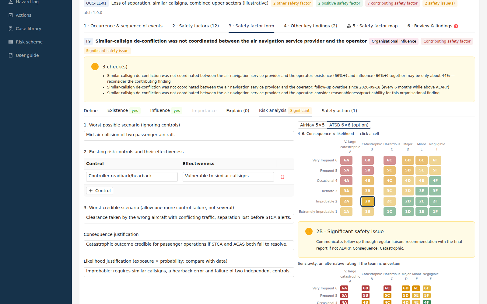

**4 · Other key findings.** Basic evidence tables for findings that are not safety factors.

**5 · Safety factor map.** Generated from the verified influences, in the ORLIO lanes.

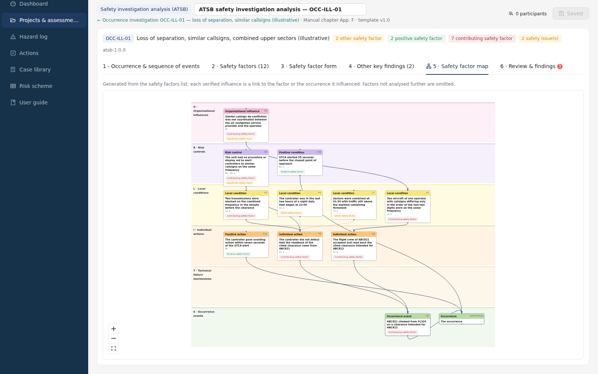

**6 · Review & findings.** The findings organised for the report; the safety issues with **Send to hazard log** (AirNav-rated issues keep their 5×5 rating; ATSB-rated issues carry the 6×6 rating in the text, to be rated on the AirNav scheme in the log); all checks (errors, warnings, notes) with links to the factor; the analysis review checklist and the stop rule.

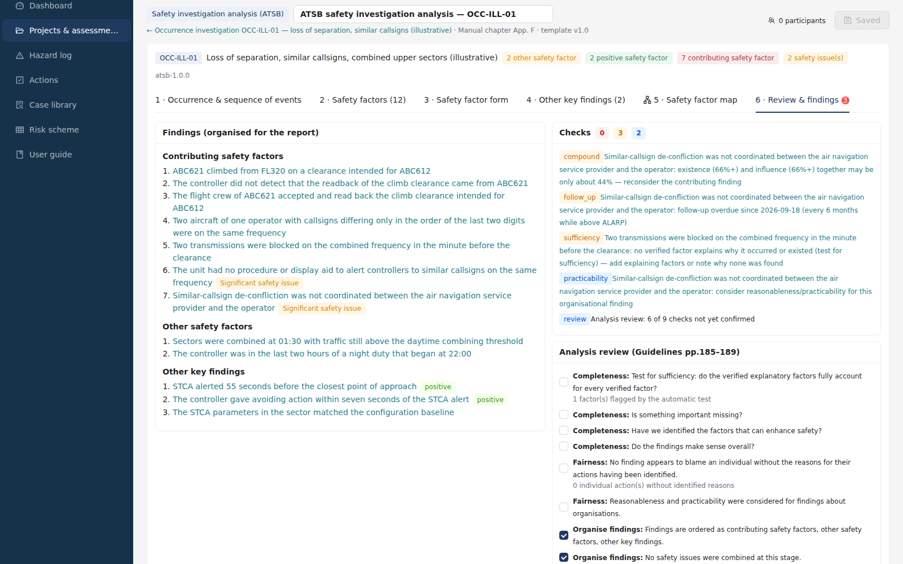

How ARAP derives the finding type: existence + influence on the occurrence or a contributing factor → **contributing safety factor**; influence only on a non-contributing factor, or existence + importance → **other safety factor**; positive actions and conditions → **positive safety factor**; existence not shown → *not established*. The checks include arguments from ignorance (supported with no supporting item), conclusions below the standard of proof, two "just likely" tests that together fall below 50 %, evidence from one source, judgemental wording, the **test for sufficiency** (a contributing factor with no explaining factor) and **fairness** (an individual action with no identified reasons).

**The ATSB 6×6 option.** The Risk scheme page shows it beside the AirNav matrix. ATSB does not publish its cell colours as text, so ARAP uses the AirNav colours by the same pattern: critical = intolerable red; significant = amber (near critical) and yellow, like AirNav's two tolerable bands; broadly acceptable = green. Every catastrophic cell is at least significant.

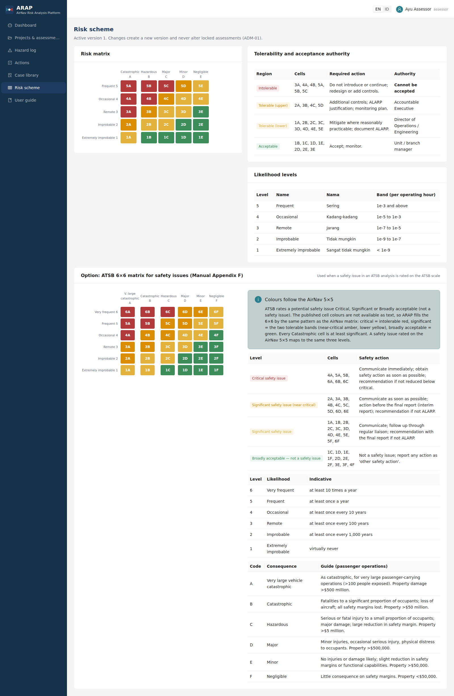

Demo project **DEMO-06** contains the ATSB analysis of the illustrative occurrence OCC-ILL-01: 11 events, 7 contributing and 2 other safety factors, 2 positive safety factors and 2 significant safety issues — one rated on the AirNav 5×5 (3B) and one on the ATSB 6×6 (2B).

## 14. The hazard log

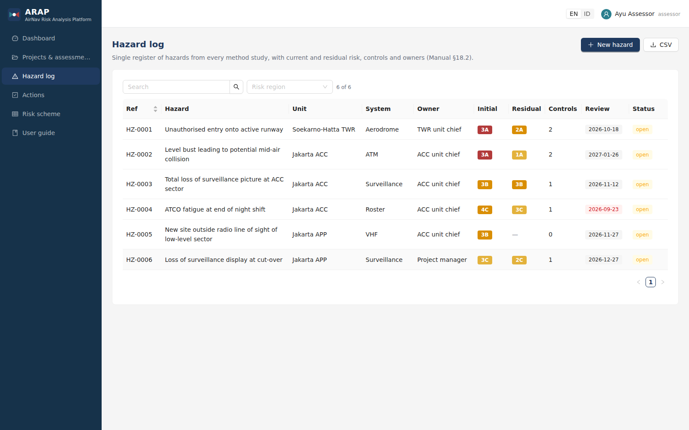

The hazard log is the single register of hazards from all studies (Manual §32.2). Search, filter by risk region, sort, and export to **CSV**. Overdue review dates are shown in red.

Click a hazard to open it:

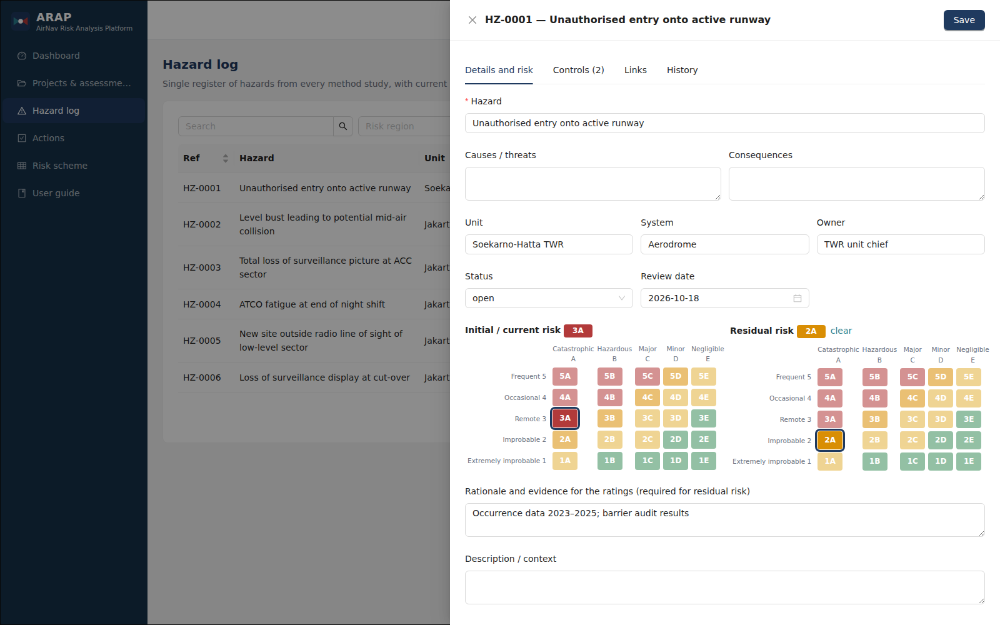

- **Details and risk** — description, causes, consequences, unit, system, owner, status and review date. Rate **initial/current** and **residual** risk by clicking a cell in each matrix. A residual rating requires a **rationale** (the basis of the judgement).
- When you create a new hazard, ARAP checks for **possible duplicates** as you leave the title field.
- **Controls** — each with side (prevention/recovery), type, status, effectiveness, owner and a safety-critical flag. Only *existing-verified* controls may be credited in the current risk.
- **Links** — the source study, the assessment and the related actions.
- **History** — every change from the audit trail.

---

## 15. Actions

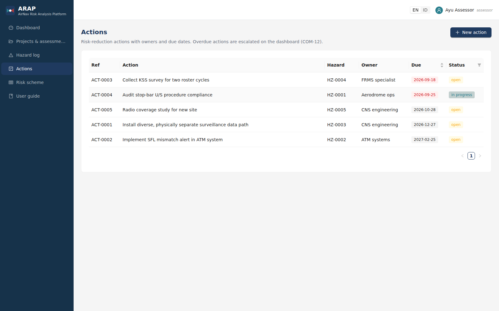

Actions have an owner, a due date, a status (open, in progress, closed) and an optional link to a hazard. Overdue actions are flagged here and on the dashboard. **Closing an action requires closure evidence** (e.g. a report number). A Viewer can update an action when the action’s owner field is their username.

---

## 16. Review, approval and locking

| Status | Meaning | Next step and who does it |
|---|---|---|
| **Draft** | Being prepared; editable. | **Submit for review** — assessor |
| **In review** | Reviewer checking. | **Endorse** or **Return to assessor** (comment required) — reviewer |
| **Endorsed** | Reviewed; locked. | **Accept residual risk** — authority for the worst residual region; or **Reject** (comment required) |
| **Accepted** | Residual risk accepted; locked. | **Close** — reviewer or authority |
| **Rejected** | Not accepted. | Revise and **Submit** again |
| **Closed / Superseded** | Finished, or replaced by a newer version. | — |

**Rules ARAP enforces**

- An assessment with an **intolerable** residual risk cannot be accepted.
- An assessment with **no hazards** cannot be accepted.
- The person accepting must hold authority for the **worst** residual risk region in the assessment (e.g. *Tolerable (upper)* needs the Accountable Executive).
- Endorsed, accepted and closed assessments are **locked**: studies and hazards become read-only. To change anything, use **New version**. This copies the studies into a new draft (version n+1) and marks the old version *superseded*.

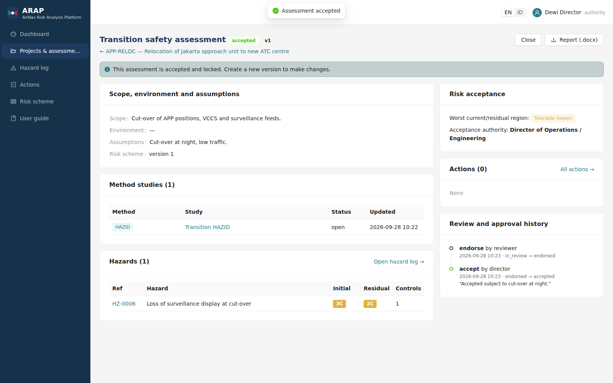

Every transition is recorded in the **review and approval history** and the audit trail.

---

## 17. Reports and exports

| What | Where | Format |
|---|---|---|
| Safety Assessment Report (Manual §32.3) | Assessment page → **Report (.docx)** | Word |
| Hazard log | Hazard log → **CSV** | CSV (opens in Excel) |
| Bowtie diagram | Bowtie editor → **PNG** / **SVG** | Image |

The report includes scope, methods used, hazards and their risk ratings, study results (fault tree cut sets, LOPA verdict, fatigue indicators, Bayesian network probabilities, and for the extended methods the event-tree outcomes, collision risk, HEPs, availability, simulation statistics, expert weights, occurrence classifications, the GSN argument and the investigation findings), actions, the approval history, and the versions of the risk scheme and calculation engines used.

---

## 18. Administration

### 18.1 Risk scheme

**Risk scheme** shows the matrix, the tolerability regions with their required action and acceptance authority, and the likelihood levels with their quantitative bands.

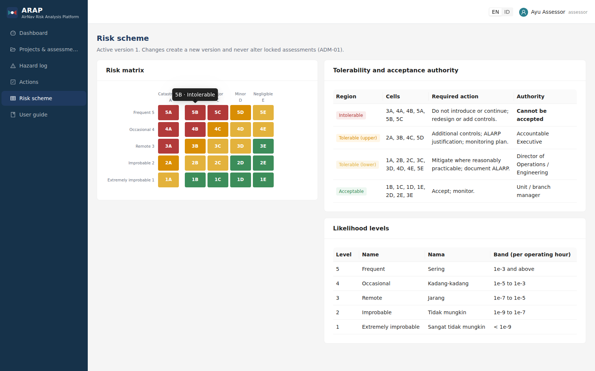

Administrators can reassign cells: choose a region under **Paint region**, click the cells, then **Save as new version**. ARAP checks that every cell belongs to exactly one region. Existing assessments keep the version they were created with.

### 18.2 Users

**Users** (administrators only) lists accounts. Click one to edit, or **New user** to add one. Set the role, unit and — for authorities — the risk regions they may accept. Deactivate rather than delete leavers.

### 18.3 Audit trail

**Audit trail** (reviewers and administrators) lists every create, change, approval and export with the user, time and changed fields. Filter by entity.

---

## 19. Troubleshooting and FAQ

**I can't edit a study or hazard.** Either your role is Viewer or Authority, or the assessment is endorsed/accepted/closed. Use **New version** on the assessment page (assessor or reviewer).

**“A rationale is required for every risk judgement”.** Fill in *Rationale and evidence* in the hazard before saving a residual rating.

**“Residual risk region … requires …”.** You do not hold authority for the worst residual risk in the assessment. Ask the named authority to accept it.

**The worksheet did not keep my edit.** Finish the edit (Enter or click another cell), then press **Save** in the header.

**My session ended.** Sessions last 8 hours by default; sign in again.

**Numbers differ slightly from the Manual.** The engines reproduce the Manual's worked examples within the tolerances in SRS §9. Rounding in the Manual text is to 2–3 significant figures.

---

## 20. What version 0.8 does not do yet

Version 0.8 covers the core workflow and all twenty-six methods. The following SRS items are planned for later releases:

- Single sign-on through Keycloak / SAML / OIDC with MFA. Version 0.2 uses local accounts with JWT tokens.
- Real-time co-editing of a diagram by several users, and the offline workshop pack.
- Imports and exports in BowTieXP XML, Open-PSA MEF, XMLBIF, GeNIe and FRAM Model Visualiser formats.
- File attachments (MinIO), e-mail notifications and reminders.
- Integrations with the occurrence reporting, rostering and maintenance systems.
- CAST (STPA for accident analysis), noisy-OR helpers for Bayesian networks, Monte Carlo uncertainty, and the full “braked” sleep-recovery form of the fatigue model.
- An Apache Superset / Metabase reporting database.
- Linking SPI-register rows to bowtie barriers so barrier health shows the SPI status (SRS SPI-03).
- Deleting a single assessment (only whole projects can be deleted), and a retention period after which archived projects are purged.
- For the investigation expert system: meaning-based search with text embeddings (pgvector), network structures other than mechanism → factors (e.g. noisy-OR between factors), statistical validation reports against held-back cases, and AI drafting tested only against a simulated service in the automated tests.
- For the ATSB analysis: rail and marine taxonomies, a report generator that writes the findings section, and administrator editing of the ATSB 6×6 cell assignment (the matrix is fixed in this version).
- Saving an existing assessment as a new template, and administrator editing of templates (SRS TPL-05).
- For the wildlife module: import of strike records from the occurrence system and in ICAO IBIS format.
- For the extended methods: import of occurrences from the reporting system into the ERC/RAT module, CRM sensitivity cases, administrator editing of the CARA/HEART libraries, and restricted (need-to-know) access to security studies (SRS SRA-04).
